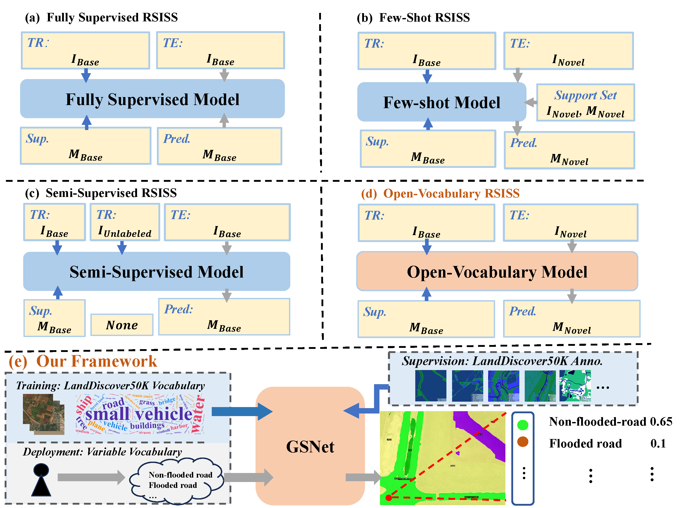
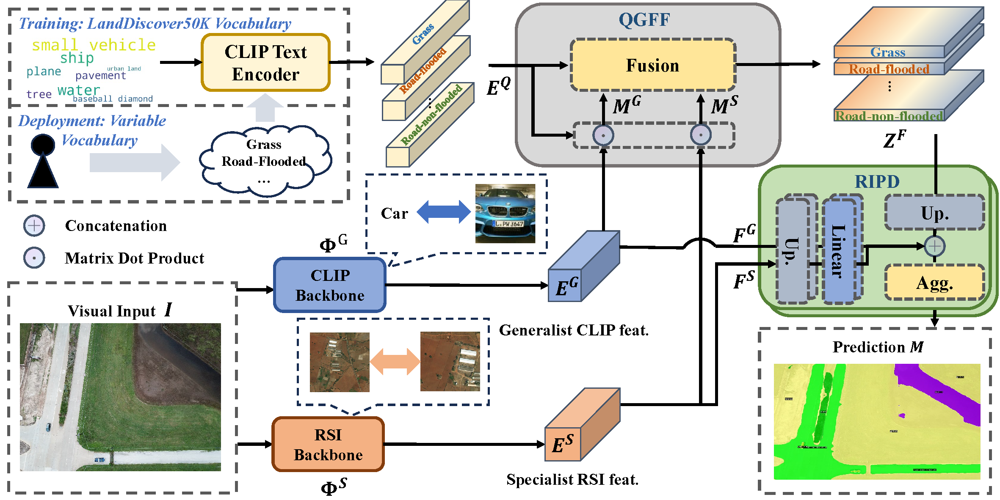

# (AAAI 2025) Towards Open-Vocabulary Remote Sensing Image Semantic Segmentation

by Chengyang Ye, Yunzhi Zhuge, [Pingping Zhang](https://scholar.google.com/citations?user=MfbIbuEAAAAJ&hl=zh-CN)\*

[Paper](https://arxiv.org/pdf/2412.19492)

## Introduction
### New Task: Open-Vocabulary RSI Semantic Segmantation (OVRSISS)

- OVRSISS aims at segmenting **arbitrary** semantic class in RSI domain. 
- OVRSISS methods need **no finetuning** adapting to **new classes**.

### New Dataset: LandDiscover50K (LD50K)

- **51,846** RSI images covering **40** diverse semantic classes.
- Building upon established RSISS datasets, including [OEM](), [LoveDA](), [DeepGlobe](), [SAMRS](). For further details, please refer to the paper.
- Elevates the performance of OVRSISS by providing **large-scale**, **multi-domain**, **multi-granularity** RSI images with comprehensive class annotations.


### New Approach: GSNet (Generalist and Specialist Network)

- Dual-Stream Image Encoder
  - Generalist: CLIP backbone for **open-vocabulary recognition**.
  - Specialist: RSI backbone for **domain-specific expertise**.
- Query-Guided Feature Fusion
  - Efficient Fusion of Generalist and Specialist Features under the guidance of text-based queries.
- Residual Information Preservation Decoder
  - Aggregates multi-source features for more accurate mask
    predictions.
  - Detail refinement and backbone regularization.

## Prepare datasets
### Training Dataset: LD50K
- Download LandDiscover50K from this [hugginface repo](https://huggingface.co/datasets/Stev929/LandDiscover50K)
- Merge the downloaded parts into a complete zip file:
    ```bash
    cat LD50KSplit.z* > LandDiscover50K.zip
    ```
- Extract the complete zip file to a specified directory:
    ```bash
    unzip LandDiscover50K.zip -d ./dst_dir
    ```
### Testing Datasets: FloodNet, FLAIR, FAST, Potsdam
- We provide pre-processed test images and masks for users' convenience. Download them from [here](https://huggingface.co/datasets/Stev929/OVRSISS_test/tree/main).
- For pre-process of the testing datasets, check the [paper](https://arxiv.org/pdf/2412.19492).

### Expected data strcture
```
$DETECTRON2_DATASETS  
├── LandDiscover50K  
│   ├── GT_ID  
│   └── TR_Image  
├── FAST  
│   └── val  
│       ├── images  
│       └── semlabels  
├── PotsdamSplit  
│   ├── ann_dir  
│   └── img_dir  
├── FLAIR  
│   └── test  
│       ├── image  
│       └── mask  
├── FloodNet  
│   └── val+test  
│       ├── img 
│       └── lbl  
```


## Installation
An example of installation is shown below:
```
git clone https://github.com/yecy749/GSNet.git
cd GSNet
conda create -n gsnet python=3.8
conda activate gsnet
conda install pytorch==2.3.0 torchvision==0.18.0 torchaudio==2.3.0 pytorch-cuda=11.8 -c pytorch -c nvidia
pip install -r requirements.txt
```
- Linux with Python ≥ 3.8 required
- Ensure that the versions of PyTorch, TorchVision, and Detectron2 are compatible. For more information, refer to [pytorch.org](https://pytorch.org) and the  [Detectron2 install guide](https://detectron2.readthedocs.io/tutorials/install.html).

## Training and Evaluation

- Download the pretrained [Specialist RSI Backbone weights](https://drive.google.com/file/d/1kH0wDM_Hl4sEQJG8JjILCo0RTx65X7zV/view?usp=sharing).
- Specify root path of datasets & RSIB weight path.
- Command for Training
    ```bash
    sh scripts/train.sh configs/vitb_384.yaml [NUM_GPUs] [TRAIN_RESULTS_DIR]
    ```
- We provide [pretrained weights for our model](https://drive.google.com/file/d/1YMAZj5fMUI3uSCvUmGHzyf4LthXdji0Y/view?usp=sharing) reported in the paper. Reproduction can be made through command line scripts below.
- Command for Evaluation
    ```bash
    sh scripts/eval.sh configs/vitb_384.yaml [NUM_GPUs] [EVAL_RESULTS_DIR] \
    MODEL.WEIGHTS [MODEL_WEIGHTS_PATH]
    ```
- An example of training and evaluation command is provided in `scripts/run.sh`.


## Acknowledgement
We sincerely thank the contribution made by open-source projects and datasets, such as DETECTRON, CAT-SEG, SAMRS, OEM, LoveDA, DeepGlobe. 
## **Citing GSNet**

If you find **GSNet** helpful in your research, please consider citing:

```bibtex
@inproceedings{ye2025GSNet,
  title={Towards Open-Vocabulary Remote Sensing Image Semantic Segmentation},
  author={Ye, Chengyang and Zhuge, Yunzhi and Zhang, Pingping}
  booktitle={Proceedings of the AAAI Conference on Artificial Intelligence},
  year={2025}
}
```